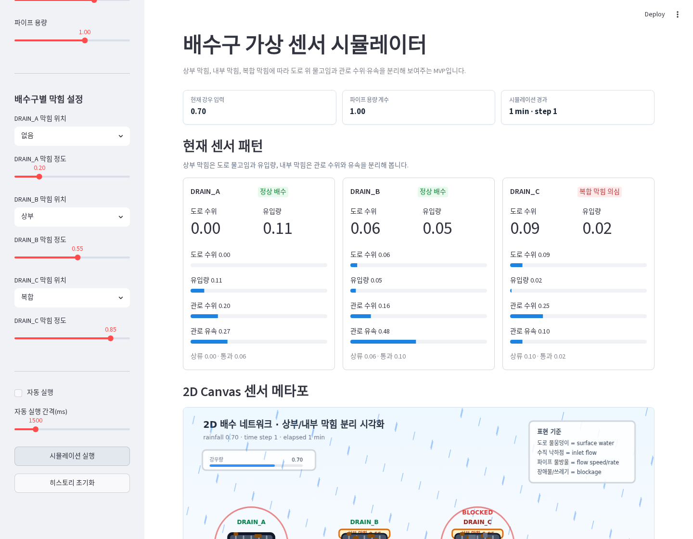

# Drain Sensor Simulator

`drain-sensor-simulator`는 실제 수위·유속 센서가 아직 없는 단계에서 쓰는 Streamlit 기반 가상 배수구 센서 시뮬레이터입니다.

강우량, 배수구별 막힘 위치, 막힘 정도를 바꾸면 다음 값을 mock sensor payload로 만들고 2D Canvas로 시각화합니다.

```text
강우량
+ 상부 막힘 / 내부 막힘 / 복합 막힘
+ 시간 흐름
↓
도로 위 물고임
+ 배수구 유입량
+ 관로 수위
+ 관로 유속
+ 관로 유량
↓
Streamlit dashboard
+ 2D Canvas visual metaphor
+ mock sensor JSON/JSONL/API
```

## 범위

이 프로젝트는 다음이 아닙니다.

- XGBoost 학습기 아님
- YOLO 실행기 아님
- SWMM/PySWMM 수리해석 모델 아님
- 실제 센서 API 연동 아님
- CSV 학습 데이터 생성기 아님
- 실제 침수 예측기 아님

현재 목표는 실제 센서가 없어도 데모, UI/UX, API 계약, 센서값 흐름을 검증할 수 있는 mock sensor simulator입니다.

## 빠른 시작

```bash
pip install -r requirements.txt
streamlit run app.py
```

개발/검증 환경은 다음 명령을 사용합니다.

```bash
pip install -r requirements-dev.txt
pytest -q
ruff check .
```

Makefile을 쓰는 경우:

```bash
make install-dev
make run
make test
make lint
```

Docker 이미지로 Streamlit UI와 Mock API를 함께 바로 실행하는 경우:

Linux/macOS 또는 Git Bash:

```bash
docker pull ghcr.io/monancho/drain-sensor-simulator-dev:latest

docker run --rm \
  -p 8501:8501 \
  -p 8765:8765 \
  ghcr.io/monancho/drain-sensor-simulator-dev:latest
```

Windows PowerShell:

```powershell
docker pull ghcr.io/monancho/drain-sensor-simulator-dev:latest
docker run --rm -p 8501:8501 -p 8765:8765 ghcr.io/monancho/drain-sensor-simulator-dev:latest
```

접속:

- Streamlit UI: `http://127.0.0.1:8501`
- Mock API: `http://127.0.0.1:8765`

컨테이너 안에서는 Streamlit과 API가 같은 `/app/.runtime`을 공유합니다. Streamlit에서 `시작` 또는 `1 step`을 사용한 뒤, `API 설정` 탭의 endpoint를 Postman에서 polling하면 화면과 같은 최신 mock 센서값을 가져올 수 있습니다.

```bash
curl "http://127.0.0.1:8765/drains/b/latest"
```

Dev Container를 쓰는 경우:

```bash
code .
# VS Code에서 Reopen in Container
make install-dev
make run
```

## Streamlit 데모 흐름

1. 왼쪽 사이드바에서 `기준 강우량`, `강우 변동량`, `파이프 용량`, `A/B/C` 막힘 위치와 정도를 조절합니다.
2. `강우 변동량`이 0이면 고정 강우, 0보다 크면 기준 강우량 주변에서 부드럽게 변합니다.
3. `시작`을 누르면 자동 진행되고, `정지`를 누르면 멈춥니다. `1 step`은 한 번만 진행합니다.
4. 상단 카드에서 현재 센서 패턴을 확인합니다.
5. `2D Canvas 센서 메타포`에서 도로 물고임, 유입, 관로 흐름, 막힘 위치를 봅니다.
6. 하단 탭에서 `실시간 그래프`, `센서 데이터`, `시나리오`, `API 설정`을 전환합니다.
7. `센서 데이터` 탭에서 snapshot JSON과 flat JSONL records를 내려받을 수 있습니다.
8. `API 설정` 탭에서 Postman용 latest endpoint를 생성하고 runtime/live mock 값을 확인할 수 있습니다.



데모 스크린샷이나 GIF는 `docs/demo-assets/`에 보관합니다.

## Streamlit Community Cloud 배포

GitHub push가 끝난 뒤 Streamlit Community Cloud에서 바로 공개 데모를 만들 수 있습니다.

1. `https://share.streamlit.io`에 GitHub 계정으로 로그인합니다.
2. `Create app`을 누르고 이 저장소, `main` 브랜치, entrypoint `app.py`를 선택합니다.
3. Python dependency는 루트의 `requirements.txt`를 사용합니다.
4. 이 프로젝트는 외부 secrets가 필요 없습니다. `.streamlit/secrets.toml`은 만들지 않습니다.
5. 배포 후 생성된 `*.streamlit.app` URL을 README 상단이나 GitHub repo About 영역에 추가합니다.

### Streamlit UI 데모와 Mock API의 차이

Streamlit Community Cloud는 기본적으로 `streamlit run app.py`로 UI 앱을 실행합니다. 따라서 이 저장소를 Streamlit Cloud에 배포하면 대시보드, Canvas, 시나리오 타임라인, `API 설정` 탭의 live mock 미리보기 패널은 사용할 수 있습니다.

다만 `python api.py`로 여는 로컬 mock HTTP API는 Streamlit Cloud 배포에서 별도 포트 서비스로 함께 공개된다고 가정하지 않습니다. 외부 프론트엔드나 백엔드가 `GET /api/v1/sensors/b/latest` 같은 HTTP endpoint를 직접 호출해야 한다면, `api.py`는 Render, Railway, Fly.io, VM 같은 별도 Python HTTP 서비스로 배포해야 합니다.

정리하면:

| 목적 | 배포 대상 |
|---|---|
| 웹 데모 화면 확인 | Streamlit Community Cloud (`app.py`) |
| API 계약 테스트, 외부 시스템 polling | 별도 API 서버 (`api.py`) |
| Streamlit 안에서 live latest 값 확인 | Streamlit UI의 `API 설정` 탭 |

공식 문서:

- [Prep and deploy your app on Community Cloud](https://docs.streamlit.io/deploy/streamlit-community-cloud/deploy-your-app)
- [App dependencies for Community Cloud](https://docs.streamlit.io/deploy/streamlit-community-cloud/deploy-your-app/app-dependencies)

## Docker 이미지 실행

외부 사용자는 `docker-compose.yml`을 만들 필요 없이 공개 이미지를 받아 바로 실행할 수 있습니다. 컨테이너 하나에서 Streamlit UI와 Mock API가 함께 실행됩니다.

```text
container
  ├─ streamlit run app.py  -> 8501
  └─ python api.py         -> 8765
```

실행:

Linux/macOS 또는 Git Bash:

```bash
docker pull ghcr.io/monancho/drain-sensor-simulator-dev:latest

docker run --rm \
  -p 8501:8501 \
  -p 8765:8765 \
  ghcr.io/monancho/drain-sensor-simulator-dev:latest
```

Windows PowerShell:

```powershell
docker pull ghcr.io/monancho/drain-sensor-simulator-dev:latest
docker run --rm -p 8501:8501 -p 8765:8765 ghcr.io/monancho/drain-sensor-simulator-dev:latest
```

확인:

```bash
curl "http://127.0.0.1:8765/health"
curl "http://127.0.0.1:8765/drains/b/latest"
curl "http://127.0.0.1:8765/drains/b/latest/detail"
```

처음에는 Streamlit이 아직 snapshot을 저장하지 않았으므로 `/drains/b/latest` 호출이 `runtime_snapshot_not_found`를 반환할 수 있습니다. 브라우저에서 `http://127.0.0.1:8501`을 열고 `1 step`을 한 번 누르거나 `시작`을 누른 뒤 다시 호출하면 최신 mock 센서값이 반환됩니다.

runtime 공유 경로는 기본적으로 `/app/.runtime`입니다. 다른 볼륨이나 경로를 쓰려면 `DRAIN_SIM_RUNTIME_DIR` 환경변수를 바꿀 수 있습니다.

```bash
docker run --rm \
  -p 8501:8501 \
  -p 8765:8765 \
  -e DRAIN_SIM_RUNTIME_DIR=/data/runtime \
  -v drain-sensor-runtime:/data/runtime \
  ghcr.io/monancho/drain-sensor-simulator-dev:latest
```

컨테이너 헬스체크는 API의 `/health` endpoint를 기준으로 동작합니다.

### GitHub Container Registry

`.github/workflows/docker-image.yml`은 `main` 브랜치에 push될 때 GitHub Container Registry에 이미지를 발행합니다.

- `main` push: `ghcr.io/monancho/drain-sensor-simulator-dev:latest`
- tag push: `ghcr.io/monancho/drain-sensor-simulator-dev:<tag>`
- commit별 추적용: `ghcr.io/monancho/drain-sensor-simulator-dev:sha-<commit>`

GitHub repository의 package visibility가 private이면 외부 사용자는 pull 권한이 필요합니다. 공개 데모용이면 GHCR package를 public으로 전환하면 `docker pull`만으로 사용할 수 있습니다.

## Docker Compose 로컬 통합 실행

`docker-compose.yml`은 개발/로컬 통합 테스트용 편의 파일입니다. 공개 이미지 사용자는 compose 파일을 직접 만들 필요가 없습니다.

```text
container
  ├─ streamlit run app.py  -> 8501
  └─ python api.py         -> 8765
```

실행:

```bash
docker compose up --build
```

확인:

```bash
docker compose ps
curl "http://127.0.0.1:8765/health"
curl "http://127.0.0.1:8765/drains/b/latest"
```

처음에는 Streamlit이 아직 snapshot을 저장하지 않았으므로 `/drains/b/latest` 호출이 `runtime_snapshot_not_found`를 반환할 수 있습니다. 브라우저에서 `http://127.0.0.1:8501`을 열고 `1 step`을 한 번 누르거나 `시작`을 누른 뒤 다시 호출하면 최신 mock 센서값이 반환됩니다.

runtime 공유 경로는 기본적으로 `/app/.runtime`입니다. 다른 볼륨이나 경로를 쓰려면 `DRAIN_SIM_RUNTIME_DIR` 환경변수를 바꾸면 됩니다.

컨테이너 헬스체크는 API의 `/health` endpoint를 기준으로 동작합니다. `docker compose ps`에서 서비스가 `healthy`로 표시되면 Mock API가 정상 응답하는 상태입니다.

## 막힘 구분 정책

| 구분 | 센서 패턴 |
|---|---|
| 상부 막힘 | 도로 위 물고임 증가 + `inlet_flow` 감소 |
| 내부 막힘 | `pipe_water_level` 증가 + `pipe_flow_speed` 감소 |
| 복합 막힘 | 상부/내부 패턴이 동시에 발생 |

중요 해석 정책:

```text
수위 높음 + 유속 높음 = 배수 진행 중
수위 높음 + 유속 낮음 = 정체 의심 / 내부 정체 의심
도로 위 물고임 높음 + 유입량 낮음 = 상부 유입 막힘 의심
```

`DRAIN_A → DRAIN_B → DRAIN_C → OUTFALL` 단순 주관로를 가정합니다. B/C가 상부 막힘이어도 그 막힘은 로컬 유입구 문제이므로, A에서 이미 관로로 들어간 흐름은 가능한 범위에서 하류로 통과합니다.

C 같은 하류 내부 막힘은 단순 `downstream_backwater`로 B/A 관로 수위를 함께 올릴 수 있고, 강우가 계속되어 관로가 충분히 차면 `pipe_surcharge_to_surface`로 도로 위 물고임이 추가됩니다. 도로 위 물고임이 커지면 `surface_spill_in`/`surface_spill_out`으로 인접 하류 노드에 일부 물이 전달되어, C가 막히지 않았더라도 C 유입량이 늘 수 있습니다.

Canvas 시각화는 실제 유체역학이 아니라 센서값을 직관적으로 보여주는 visual metaphor입니다.

## 주요 파일

| 파일 | 역할 |
|---|---|
| `app.py` | Streamlit UI, 세션 상태, 히스토리 관리 |
| `simulation.py` | 시간 기반 가상 센서 시뮬레이션 |
| `sensor_model.py` | 센서 상태 해석 |
| `visualization.py` | 표, 그래프, Canvas payload 생성 |
| `canvas_renderer.py` | HTML Canvas 기반 물 흐름 메타포 렌더링 |
| `sensor_payload.py` | mock sensor payload/records 생성 |
| `sensor_api_service.py` | API 요청 정규화, snapshot/timeseries 생성, 센서 현실감 후처리 |
| `runtime_state.py` | Streamlit UI와 mock API가 공유하는 runtime snapshot 저장소 |
| `api.py` | 로컬 mock sensor HTTP API |
| `docs/BACKEND_API_SPEC.md` | 백엔드/Postman 연동용 API 명세 |
| `docs/SENSOR_SIMULATION_POLICY.md` | 시뮬레이션 정책과 한계 |

## Mock Sensor API

`api.py`는 실제 센서 API가 아니라, 향후 연동을 염두에 둔 로컬 mock 계약 서버입니다.
Streamlit UI 배포와는 별개로 실행되는 HTTP API입니다.

백엔드 연동자는 먼저 [`docs/BACKEND_API_SPEC.md`](docs/BACKEND_API_SPEC.md)를 보면 됩니다.

```bash
python api.py
```

기본 주소는 `http://127.0.0.1:8765`입니다.

| Endpoint | 설명 |
|---|---|
| `GET /health` | API 상태 확인 |
| `GET /drains/{a,b,c}/latest` | Streamlit runtime 기반 compact 최신 센서값 |
| `GET /drains/{a,b,c}/latest/detail` | Streamlit runtime 기반 상세 최신 센서값 |
| `GET /api/v1/sensors/schema` | schema version, 기본 drain 설정, scenario 목록 |
| `GET /api/v1/sensors/snapshot` | 현재 요청 조건으로 시뮬레이션한 JSON snapshot |
| `GET /api/v1/sensors/snapshot?source=runtime` | Streamlit이 마지막으로 저장한 runtime snapshot |
| `GET /api/v1/sensors/records` | snapshot을 flat records로 변환 |
| `GET /api/v1/sensors/{a,b,c}/latest` | 특정 배수구의 최신 flat record만 반환 |
| `GET /api/v1/sensors/{a,b,c}/latest?source=runtime` | Streamlit 화면과 같은 runtime 최신값 반환 |
| `GET /api/v1/sensors/timeseries` | scenario를 여러 snapshot과 records로 반환 |
| `POST /api/v1/sensors/simulate` | JSON body로 조건을 받아 snapshot 반환 |
| `POST /api/v1/sensors/scenario` | JSON body로 scenario 조건을 받아 timeseries 반환 |

### API 예시

상태 확인:

```bash
curl "http://127.0.0.1:8765/health"
```

실제 센서처럼 최소 필드만 가져오는 짧은 최신값 API:

```bash
curl "http://127.0.0.1:8765/drains/a/latest"
curl "http://127.0.0.1:8765/drains/b/latest"
curl "http://127.0.0.1:8765/drains/c/latest"
```

compact 응답은 다음 필드만 포함합니다.

```json
{
  "drain_id": "DRAIN_B",
  "timestamp": "2026-06-17T09:20:00",
  "surface_water_level": 0.61,
  "pipe_water_level": 0.42,
  "pipe_flow_speed": 0.31
}
```

compact 응답에는 실제 센서값이 아닌 판단/시뮬레이터 필드인 `status`와 `inlet_flow`를 포함하지 않습니다.

상세 mock/debug 필드가 필요할 때:

```bash
curl "http://127.0.0.1:8765/drains/b/latest/detail"
```

기존 `/api/v1/sensors/...` endpoint는 mock API 계약, scenario, live profile, 상세 디버깅 용도로 계속 유지됩니다.

단일 snapshot:

```bash
curl "http://127.0.0.1:8765/api/v1/sensors/snapshot?rainfall=0.8&pipe_capacity=1.0&steps=10&drain_a_location=none&drain_b_location=surface&drain_b_severity=0.9&drain_c_location=internal&drain_c_severity=0.8"
```

flat records:

```bash
curl "http://127.0.0.1:8765/api/v1/sensors/records?rainfall=1&steps=12&drain_b_location=surface&drain_b_severity=1"
```

특정 배수구 최신값:

```bash
curl "http://127.0.0.1:8765/api/v1/sensors/b/latest?rainfall=0.8&steps=10&drain_b_location=surface&drain_b_severity=0.8"
```

Polling 기반 live mock 최신값:

```bash
curl "http://127.0.0.1:8765/api/v1/sensors/b/latest?mode=live&profile=storm_pulse"
```

내부 정체 live profile:

```bash
curl "http://127.0.0.1:8765/api/v1/sensors/c/latest?mode=live&profile=internal_stagnation_live"
```

재현 가능한 live tick 테스트:

```bash
curl "http://127.0.0.1:8765/api/v1/sensors/b/latest?mode=live&profile=surface_debris_live&tick=10&seed=demo"
```

`mode=live`는 WebSocket/SSE가 아니라 polling용 mock 최신값입니다. 프론트엔드나 백엔드는 응답의 `live.next_poll_after_ms` 값을 기준으로 2초 안팎마다 같은 endpoint를 다시 호출하면 됩니다. `tick`을 생략하면 현재 시간을 `interval_sec`로 나눈 값이 사용되고, `tick`과 `seed`를 넣으면 같은 값을 재현할 수 있습니다.

### Streamlit 화면 상태를 API로 가져오기

Streamlit에서 조작 중인 센서 상태를 Postman이나 백엔드가 그대로 가져오려면 runtime source를 사용합니다.

1. Streamlit UI 실행:

```bash
streamlit run app.py
```

2. 별도 터미널에서 mock API 실행:

```bash
python api.py
```

3. Streamlit에서 `1 step`을 누르거나 `시작`을 누릅니다. 이때 현재 센서 snapshot이 `.runtime/current_snapshot.json`에 저장됩니다.

4. `API 설정` 탭에서 short endpoint를 확인하고, Postman 또는 백엔드에서 polling:

```bash
curl "http://127.0.0.1:8765/drains/b/latest"
```

상세값:

```bash
curl "http://127.0.0.1:8765/drains/b/latest/detail"
```

전체 runtime snapshot:

```bash
curl "http://127.0.0.1:8765/api/v1/sensors/snapshot?source=runtime"
```

`source=runtime`은 Streamlit이 마지막으로 저장한 현재 mock 센서 상태를 읽습니다. WebSocket/SSE가 아니라 파일 기반 runtime snapshot을 1~2초마다 polling하는 방식입니다. 아직 Streamlit에서 한 번도 step이 실행되지 않았다면 404와 함께 `runtime_snapshot_not_found`가 반환됩니다.

Docker 배포를 염두에 둘 때는 Streamlit 프로세스와 API 프로세스가 같은 `.runtime` 디렉터리를 보게 하면 됩니다. 기본 로컬 경로는 `.runtime`이고, Docker 기본 경로는 `/app/.runtime`입니다. `DRAIN_SIM_RUNTIME_DIR` 환경변수로 컨테이너 내부 공유 경로나 볼륨 경로를 지정할 수 있습니다.

scenario timeseries:

```bash
curl "http://127.0.0.1:8765/api/v1/sensors/timeseries?scenario=rain_stops&steps=30"
```

센서 현실감 옵션이 포함된 timeseries:

```bash
curl "http://127.0.0.1:8765/api/v1/sensors/timeseries?scenario=surface_blockage&steps=12&noise=true&noise_scale=0.03&seed=42"
```

주요 응답 구조:

```json
{
  "schema_version": "virtual-drain-sensor.v1",
  "source": "drain-sensor-simulator",
  "scenario": {
    "id": "surface_blockage",
    "title_ko": "상부 막힘 진행",
    "steps": 12,
    "step_minutes": 1.0,
    "quality": "mock"
  },
  "units": {
    "surface_water_level": "normalized_0_1",
    "inlet_flow": "normalized_0_1",
    "pipe_water_level": "normalized_0_1",
    "pipe_flow_speed": "normalized_0_1"
  },
  "snapshots": [
    {
      "inputs": {"rainfall": 0.85, "pipe_capacity": 1.0},
      "readings": [
        {
          "sensor_id": "SIM-DRAIN_B",
          "drain_id": "DRAIN_B",
          "quality": "mock",
          "status": "상부 유입 막힘 의심",
          "blockage": {"location": "상부", "severity": 1.0},
          "measurements": {
            "surface_water_level": 0.8123,
            "inlet_flow": 0.0,
            "pipe_water_level": 0.18,
            "pipe_flow_speed": 0.64
          }
        }
      ]
    }
  ],
  "records": [
    {
      "scenario_id": "surface_blockage",
      "drain_id": "DRAIN_B",
      "quality_flags": "mock",
      "surface_water_level": 0.8123,
      "inlet_flow": 0.0
    }
  ]
}
```

POST snapshot body:

```json
{
  "rainfall": 0.8,
  "pipe_capacity": 1.0,
  "steps": 10,
  "drains": {
    "DRAIN_A": {"location": "none", "severity": 0.0},
    "DRAIN_B": {"location": "surface", "severity": 0.9},
    "DRAIN_C": {"location": "internal", "severity": 0.8}
  }
}
```

POST scenario body:

```json
{
  "scenario": "network_passthrough",
  "steps": 18,
  "step_minutes": 1,
  "realism": {
    "noise": true,
    "noise_scale": 0.03,
    "missing": false,
    "stale": false,
    "spike": false,
    "stuck": false,
    "delay": false,
    "seed": 42
  }
}
```

## 기본 시나리오

| Scenario | 설명 |
|---|---|
| `light_rain` | 막힘 없는 약한 비 기준 패턴 |
| `heavy_rain` | 강우가 점진적으로 강해지는 패턴 |
| `rain_stops` | 비가 그친 뒤 도로 물고임이 서서히 줄어드는 패턴 |
| `surface_blockage` | B 배수구 상부 유입 막힘이 진행되는 패턴 |
| `internal_stagnation` | C 관로 내부 정체가 진행되는 패턴 |
| `complex_worsening` | 상부/내부 복합 막힘이 악화되는 패턴 |
| `network_passthrough` | B/C 상부가 막혀도 A 관로 흐름은 통과하는 패턴 |

## 센서 현실감 옵션

기본 payload는 안정적인 deterministic mock입니다. API request에 `realism` 옵션을 추가하면 실제 센서에서 흔히 생기는 품질 문제를 measurement 값에만 섞을 수 있습니다.

| 옵션 | 의미 |
|---|---|
| `noise` | 작은 측정 노이즈 |
| `missing` | 일부 측정값을 `null`로 처리 |
| `stale` | 이전 측정값이 반복되는 상태 |
| `spike` | 순간 튐값 |
| `stuck` | 특정 센서/필드가 고착되는 상태 |
| `delay` | 지정 step 이전 값으로 지연 응답 |
| `seed` | 재현 가능한 mock 생성을 위한 난수 seed |

품질 정보는 reading의 `quality`, `quality_flags`, `measurement_quality`와 flat record의 `*_quality` 필드에 기록됩니다.

예시:

```json
{
  "scenario": "surface_blockage",
  "steps": 12,
  "realism": {
    "noise": true,
    "noise_scale": 0.03,
    "missing": true,
    "missing_rate": 0.05,
    "stale": true,
    "stale_rate": 0.05,
    "spike": true,
    "spike_rate": 0.03,
    "stuck": true,
    "stuck_drain_id": "DRAIN_C",
    "stuck_field": "pipe_flow_speed",
    "delay": true,
    "delay_steps": 1,
    "seed": 42
  }
}
```

## 검증 명령

```bash
pytest -q
ruff check .
python -m py_compile app.py simulation.py sensor_model.py visualization.py canvas_renderer.py sensor_payload.py sensor_api_service.py api.py runtime_state.py
```

Streamlit과 API smoke test:

```bash
streamlit run app.py
python api.py
curl "http://127.0.0.1:8765/health"
curl "http://127.0.0.1:8765/api/v1/sensors/timeseries?scenario=network_passthrough&steps=5"
```

## GitHub 업로드 전 체크

```bash
git status --short --untracked-files=all
git branch --show-current
git remote -v
```

원격 저장소 URL을 받은 뒤에는 다음 순서로 업로드할 수 있습니다.

```bash
git add .
git commit -m "Prepare drain sensor simulator demo"
git remote add origin <GitHub repo URL>
git push -u origin main
```

이미 `origin`이 있으면 `git remote set-url origin <GitHub repo URL>`을 사용합니다.
